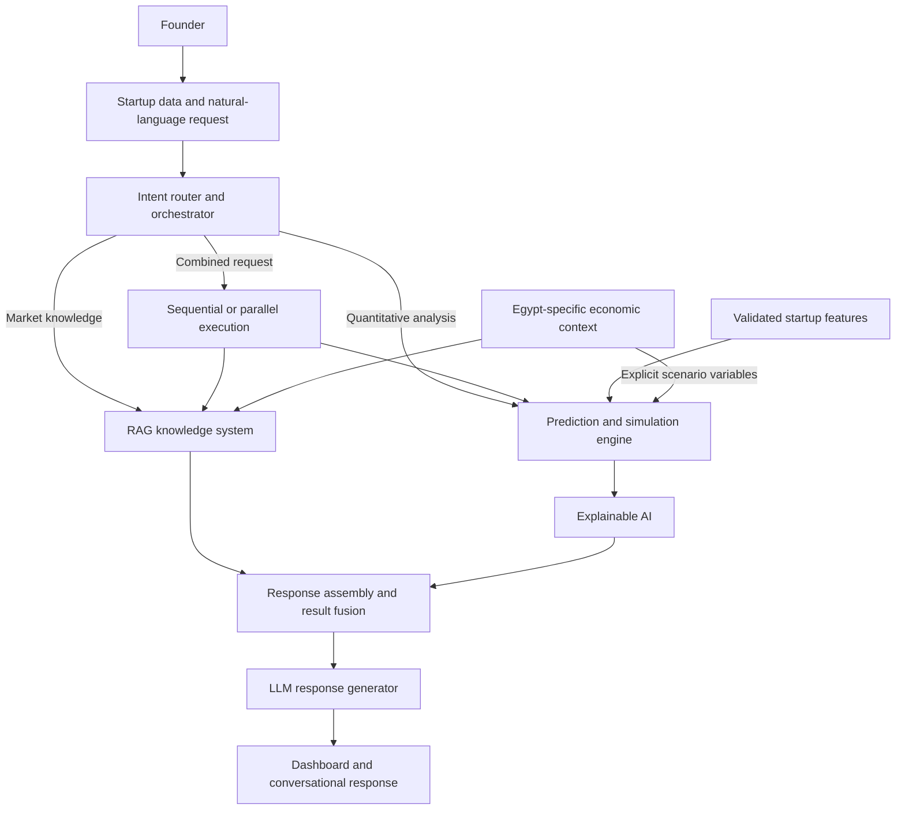

# Egyptian Startup Intelligence System

An AI-powered decision-support system for startups operating in the Egyptian market. The project aims to help founders assess business health, estimate risk and growth potential, explore what-if scenarios, and understand their results using relevant market evidence.

**Project status:** Planning stage. This repository currently contains the project README and Git branches for future development. Application code, datasets, trained models, and setup instructions will be added as implementation progresses.

## Project concept

**The user's request determines the AI workflow.** An intelligent intent router selects the appropriate combination of retrieval, prediction, simulation, and explanation instead of sending every request through a fixed pipeline.

The system separates responsibilities:

- **Predictive models** estimate numerical risk, survival, and growth outcomes from structured startup data.
- **Retrieval-Augmented Generation (RAG)** retrieves external evidence and Egyptian market context.
- **The LLM interface** interprets requests, coordinates component calls, and communicates results in natural language.
- **The dashboard** presents startup health, explanations, evidence, and scenario comparisons.

## Objectives

- Evaluate a startup's current financial and operational condition.
- Estimate failure risk within a defined time horizon.
- Estimate survival probabilities over multiple time horizons.
- Assess growth potential separately from survival.
- Compare hypothetical changes against a startup's baseline.
- Explain the factors behind model predictions.
- Ground market insights in retrieved evidence relevant to Egypt.

## User inputs

The system is planned to accept both structured startup profiles and natural-language questions.

| Input category | Examples |
| --- | --- |
| Financial performance | Revenue, monthly expenses, burn rate, cash runway, funding raised |
| Customer metrics | Number of customers, customer growth, churn, retention, customer concentration |
| Team and company | Founder count and experience, employee count, startup age |
| Business profile | Sector, business model, geographic market |
| Economic exposure | Import dependency, foreign currency revenue and expenses, exchange-rate exposure |

Example questions:

- "Is my startup currently at high risk?"
- "What happens if I reduce my burn rate by 20%?"
- "How is the Egyptian FinTech market performing?"
- "Why did the system classify my startup as high risk?"
- "What happens if I increase revenue by 30%, and is this realistic for my sector?"

## Intelligent routing

| Execution path | When it is used | Example request |
| --- | --- | --- |
| RAG only | External knowledge or market information | "How is the Egyptian e-commerce sector performing?" |
| Prediction / simulation only | Quantitative analysis using startup data, with explanation when needed | "What happens to my risk if I reduce monthly expenses by 25%?" |
| Prediction / simulation → RAG | Model results need market context | "Evaluate my startup and compare its risk with Egyptian FinTech startups." |
| RAG → simulation | Retrieved context must be translated into explicit scenario assumptions | "How would another currency devaluation affect my company?" |
| RAG + prediction / simulation | Independent evidence and model calculations can run in parallel | "Assess my startup and summarize the funding environment for its sector." |

For combined requests, a result fusion component brings model outputs, explanations, assumptions, and retrieved evidence into one response. The execution order depends on the dependencies in the request.

## Planned architecture



Combined workflows may pass prediction results to retrieval or retrieved context to simulation before assembling the response. Single-component requests use only their relevant outputs.

## Core components

| Component | Planned responsibility |
| --- | --- |
| Data pipeline | Validate startup inputs, prepare features, and support training and evaluation datasets |
| Intent router and orchestrator | Detect intent, select an execution path, and coordinate component dependencies |
| Startup prediction and risk engine | Estimate financial, operational, and failure risk within defined horizons |
| Survival analysis model | Estimate the probability of remaining operational over time, including censored observations |
| Growth potential model | Assess revenue growth, customer growth, funding, and expansion potential |
| Simulation engine | Modify scenario variables and compare predictions with the baseline |
| Explainable AI layer | Identify the features contributing to each prediction |
| RAG knowledge system | Retrieve relevant reports and generate evidence-grounded market answers |
| Egypt-specific context layer | Provide local economic variables and sector context |
| Result fusion engine | Combine predictions, scenario results, explanations, and retrieved evidence |
| LLM-based interface | Interpret questions and communicate component results clearly |
| Startup dashboard | Display health indicators, risk factors, historical performance, and scenario comparisons |

### Prediction, survival, and growth

Candidate approaches from the project brief include Logistic Regression, XGBoost, LightGBM, CatBoost, Random Survival Forest, and Survival Gradient Boosting. Model selection will depend on available data and evaluation results; no model has been implemented or selected yet.

Planned outputs include:

- Failure risk for a specified future period.
- Survival probabilities at 12, 24, 36, and potentially 60 months.
- Financial and market risk scores.
- Overall growth potential and its supporting indicators.

Survival analysis will account for startups that remain active at the end of observation through censoring. Survival and growth are separate targets: a company can remain operational without substantial growth.

Risk labels such as **Low**, **Moderate**, **High**, and **Critical** will require defined, validated thresholds. Numerical outputs must identify their prediction horizon and scoring scale.

### What-if simulation and explanation

Founders will be able to change one or more inputs, such as expenses, revenue, or currency exposure, and compare the resulting estimates with the original startup profile. Dependent metrics, such as burn rate and runway, should remain consistent with the scenario assumptions.

SHAP is a candidate explanation method for identifying influential features. Explanations should distinguish feature contributions from causal effects and present contributions on the model's appropriate output scale.

### RAG and Egyptian market context

Potential knowledge sources include Egyptian startup ecosystem reports, sector and funding reports, Central Bank publications, government statistics, investment research, accelerator reports, and venture capital reports.

Retrieved evidence should retain source references and publication dates. Local context may include inflation, exchange rates, interest rates, consumer purchasing power, import costs, funding conditions, and sector regulations. External information used in a simulation must be translated into explicit, reviewable assumptions.

### Result presentation

The dashboard and conversational interface are planned to show:

- Startup health and financial indicators.
- Risk and survival estimates with their time horizons.
- Growth potential.
- Factors increasing or reducing estimated risk.
- Baseline and scenario comparisons.
- Market benchmarks and supporting source references.

## Git branch structure

| Branch | Purpose |
| --- | --- |
| `main` | Stable, reviewed project baseline |
| `develop` | Integration branch for ongoing development |
| `feature/data-pipeline` | Input validation, dataset preparation, and feature processing |
| `feature/intent-router` | Intent detection, routing, and AI orchestration |
| `feature/prediction-engine` | Startup risk prediction and model evaluation |
| `feature/survival-analysis` | Time-to-event modeling and survival probabilities |
| `feature/growth-model` | Growth potential modeling and evaluation |
| `feature/simulation-engine` | What-if scenarios and baseline comparisons |
| `feature/explainable-ai` | Model explanations and feature contributions |
| `feature/rag-system` | Document ingestion, retrieval, and evidence-grounded answers |
| `feature/egypt-context` | Egypt-specific economic and sector data |
| `feature/result-fusion` | Combined analysis of component outputs |
| `feature/llm-interface` | Conversational interaction and response generation |
| `feature/dashboard` | Startup profile, metrics, evidence, and scenario UI |

All branches initially share the same README-only baseline. Branches identify work areas; they do not indicate completed functionality.

### Development workflow

1. Switch to the feature branch associated with the component being developed.
2. Implement and validate the change, updating documentation as needed.
3. Review and merge completed feature work into `develop`.
4. Merge validated integration work from `develop` into `main`.

Example:

```bash
git switch feature/intent-router
```

## Planned implementation milestones

1. Define the startup input schema, target definitions, prediction horizons, and data sources.
2. Prepare datasets and establish baseline prediction and survival models.
3. Develop growth modeling, explanations, and consistent what-if scenarios.
4. Build the RAG knowledge base and Egyptian context layer.
5. Integrate intent routing, component execution, and result fusion.
6. Build the conversational interface and dashboard.
7. Evaluate model quality, retrieval grounding, routing behavior, and complete user workflows.

## Interpretation and limitations

Predictions and simulations are model-based estimates, not guaranteed outcomes or causal forecasts. Their usefulness depends on data quality, target definitions, model validation, and the freshness of external evidence. The LLM communicates model results; it does not independently calculate startup success or failure probabilities.

All numerical examples in the original project brief are illustrative. This repository currently contains no measured performance results or working application.
