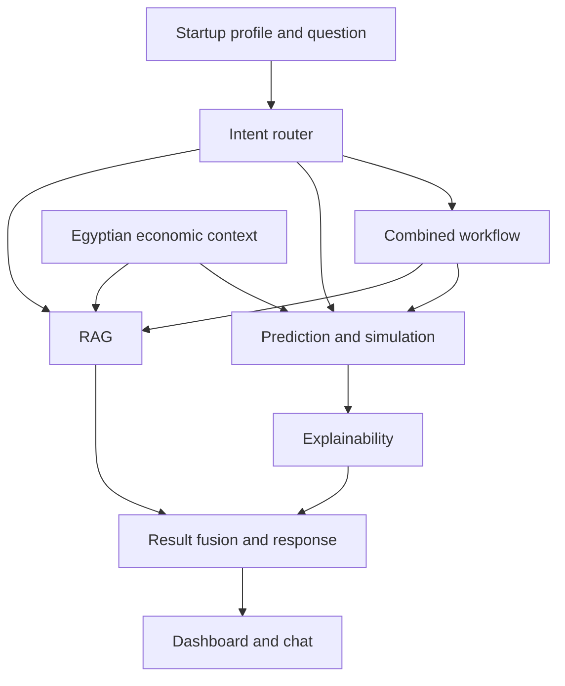

# Egyptian Startup Intelligence System

A DEPI final project for helping startup founders in Egypt understand their business, compare possible decisions, and find market information that relates to their situation.

A founder should be able to ask a question like "What if I cut monthly expenses by 20%?" and see how that changes the startup's estimated risk. They should also be able to ask why the risk is high, or whether their growth rate makes sense for their sector.

The project is at the planning stage. For now, this repository contains the README and the development branches.

## How it works

The system takes a startup profile and a question. An intent router decides which tools are needed to answer it.

Some questions only need market research. Others need a prediction based on the startup's numbers. Questions that need both use the prediction models and the RAG system together, in an order that fits the question.

| Question | Route |
| --- | --- |
| How is the Egyptian FinTech market doing? | RAG |
| What happens if I reduce expenses by 25%? | Simulation |
| Analyze my startup and explain its risk. | Prediction and explainability |
| Compare my startup's risk with its sector. | Prediction, then RAG |
| How could a currency devaluation affect my company? | RAG, then simulation |

When retrieval and prediction do not depend on each other, they can run in parallel. The result fusion component combines their outputs into one answer.



## Startup data

The startup profile will include:

- Revenue, monthly expenses, burn rate, runway, and funding raised.
- Customer count, growth, churn, and retention.
- Founder experience, team size, and startup age.
- Business sector, business model, and geographic market.
- Import dependency and exposure to foreign currency.

Egyptian market conditions also matter. Inflation, exchange rates, interest rates, funding availability, and sector regulations will help put the startup's numbers in context.

## Main components

**Prediction models** estimate failure risk, financial risk, and market risk. Each prediction needs a defined time period, such as the probability of failure within 24 months. Logistic Regression is a possible baseline, with XGBoost, LightGBM, and CatBoost as other candidates.

**Survival analysis** estimates how likely a startup is to remain operational after one, two, three, or five years. It also accounts for companies that are still active when the dataset is collected. Random Survival Forest and Survival Gradient Boosting are possible approaches.

**Growth modeling** looks at revenue growth, customer growth, funding prospects, and expansion potential. We treat growth separately from survival because a startup can stay in business without growing much.

**Simulation** lets the founder change inputs and compare the new prediction with the original one. A scenario might reduce expenses, increase revenue, or change currency exposure. Related values, such as burn rate and runway, need to stay consistent.

**Explainability** shows which factors contributed most to a prediction. SHAP is a candidate for explaining the models. These explanations describe the model's behavior; they do not prove that a factor caused the outcome.

**RAG** retrieves information from startup reports, sector research, funding reports, Central Bank publications, government statistics, and other relevant sources. Answers should include their sources and dates so founders can check the evidence.

**The router, result fusion layer, and LLM interface** connect these components. The models produce the numerical estimates, retrieval supplies external evidence, and the LLM turns the results into an understandable response.

**The dashboard** will show risk, survival probabilities, growth potential, the main contributing factors, scenario comparisons, and supporting market reports.

The final model choices will depend on the data and evaluation results.

## Branches

| Branch | Work area |
| --- | --- |
| `main` | Stable version of the project |
| `develop` | Integration of completed work |
| `feature/data-pipeline` | Startup data, validation, and feature preparation |
| `feature/intent-router` | Intent detection and workflow orchestration |
| `feature/prediction-engine` | Risk prediction models |
| `feature/survival-analysis` | Survival models |
| `feature/growth-model` | Growth prediction |
| `feature/simulation-engine` | What-if scenarios |
| `feature/explainable-ai` | Prediction explanations |
| `feature/rag-system` | Document processing, retrieval, and market answers |
| `feature/egypt-context` | Egyptian economic and sector data |
| `feature/result-fusion` | Combining model results and retrieved evidence |
| `feature/llm-interface` | Chat interface and response generation |
| `feature/dashboard` | Dashboard and scenario views |

Work on the branch for your component, then open a pull request into `develop`. Once the integrated work is ready, merge it into `main`.

```bash
git switch feature/rag-system
```

All branches start from the same README. There is no application code yet.

## Next steps

1. Agree on the input fields, prediction targets, and available datasets.
2. Build and evaluate baseline risk and survival models.
3. Add growth prediction, explanations, and scenario comparisons.
4. Prepare the RAG knowledge base and Egyptian economic data.
5. Connect the components through the router and result fusion layer.
6. Build the dashboard and chat interface, then test complete user requests.

Model results will be estimates, and what-if scenarios will depend on their assumptions. We will need to validate the models and keep market sources up to date before relying on the results.
